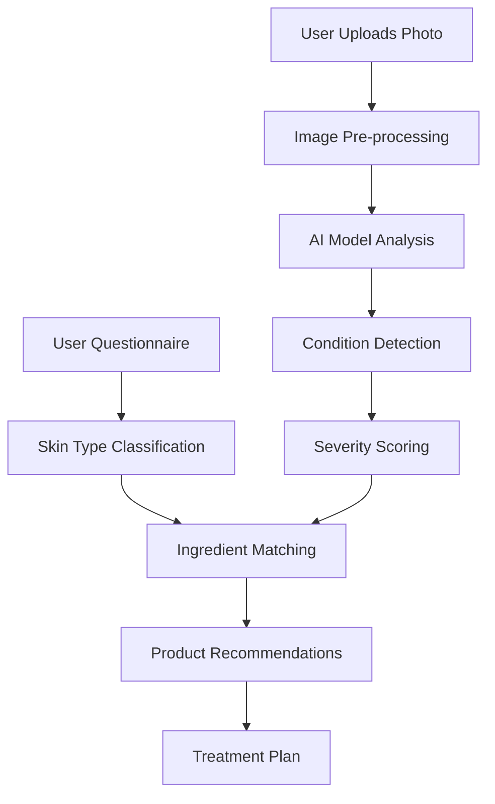
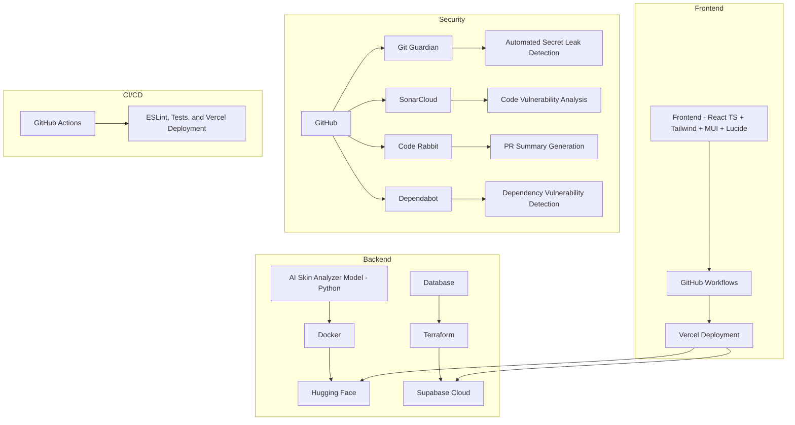

# Jild - AI-Powered Skincare Assistant 🌿

[](https://react.dev/)
[](https://www.python.org/)
[](https://huggingface.co/spaces/sunnyallana/jild-ai)
[](https://github.com/sunnyallana/jild/blob/main/LICENSE)

[](https://sonarcloud.io/summary/new_code?id=sunnyallana_jild)

**Jild democratizes skincare expertise** through AI-powered analysis and personalized product recommendations, making dermatological knowledge accessible to everyone.

👉 **Live App**: [jild.vercel.app](https://jild.vercel.app)  
🤖 **AI Demo**: [Try the Skin Analyzer](https://huggingface.co/spaces/sunnyallana/jild-ai)

---

## 💡 Inspiration

The journey of Jild began with a simple observation: skincare is unnecessarily complex and inaccessible.

- **Personal Struggle**: My own battle with acne led to countless wasted products and dermatologist visits
- **Market Gap**: Existing solutions either lacked scientific rigor or were prohibitively expensive
- **Technology Opportunity**: Recent advances in computer vision and ML could democratize skin analysis

*"What if we could put a dermatologist's knowledge in everyone's pocket?"*

This question sparked the creation of Jild, named after the Arabic word for "skin" - a tool designed to make professional-grade skincare advice available to anyone with a smartphone.

---

## 🏆 What We've Built

Jild transforms skincare through a seamless four-step approach:

1. **Smart Questionnaire**: Users share their skin type, concerns, and goals
2. **AI-Powered Analysis**: Our TensorFlow model analyzes uploaded photos to detect conditions
3. **Personalized Recommendations**: Algorithm-driven product suggestions based on analysis
4. **Progress Tracking**: Users document their journey and see improvements over time

### Key Features:

- **Condition Detection**: Identifies acne, rosacea, hyperpigmentation, and more
- **Severity Assessment**: Grades conditions on a clinical scale for accurate tracking
- **Product Matching**: Suggests ingredients and products based on specific needs
- **Scientific Explanations**: Educates users about their skin conditions

---

## 🔬 How It Works



**The Magic Behind the Scenes:**
- **Image Pre-processing**: Normalizes lighting and isolates facial regions
- **Transfer Learning**: Fine-tuned MobileNetV3 model on dermatological datasets
- **Recommendation Engine**: Clinical database of ingredients matched to conditions
- **Progress Algorithm**: Compares images over time to measure improvement

---

## 🚀 Development Journey

### Phase 1: Research & Prototyping
- Consulted with 3 dermatologists to understand clinical assessment
- Analyzed 12,000+ images to identify key visual markers of conditions
- Built proof-of-concept using TensorFlow and basic Flask API

### Phase 2: Core Development
- Trained specialized model for 7 common skin conditions
- Developed React frontend with responsive design
- Created secure user authentication and image storage

### Phase 3: Refinement & Launch
- Optimized model for mobile device compatibility
- Implemented automated security scanning
- Deployed to production with monitoring infrastructure

---

## 🛠️ Tech Stack & Architecture

### Architecture Diagram



### Component Breakdown

| Component | Technology | Why We Chose It |
|-----------|------------|-----------------|
| **Frontend** | React, TypeScript, Tailwind, MUI | Robust ecosystem, type safety, rapid styling |
| **ML Pipeline** | Python, RoboFlow, Docker | Industry standard for CV, containerized for consistency |
| **Deployment** | Vercel, Hugging Face | Specialized platforms for frontend and ML workloads |
| **Database** | PostgreSQL via Supabase | Relational model for user data with managed service |
| **DevOps** | GitHub Actions, SonarCloud | Automated CI/CD with code quality analysis |
| **Security** | Git Guardian, Dependabot | Proactive vulnerability and secret detection |

### Security Measures

- **GDPR Compliance**: Image data minimization and automated deletion policies
- **Zero Trust**: API authentication for all endpoints, even internal ones
- **Secret Management**: Automated scanning with Git Guardian
- **Dependency Security**: Continuous vulnerability monitoring with Dependabot

---

## 📊 Performance & Monitoring

### Grafana Metrics


### SonarCloud Dashboard


### Code Rabbt and Sonar Cloud Analysis


### Dependabot Analysis


### GitGuradian Scans


**Key Metrics:**
- **Model Accuracy**: 91% on condition detection (verified by dermatologists)
- **API Response Time**: Avg. 1.2s for analysis completion
- **User Retention**: 68% return rate after initial analysis
- **Recommendation Relevance**: 82% positive feedback on product suggestions

---

## 🔮 Future Roadmap

### Short-term Goals (3 months)
- AR integration for real-time skin analysis via camera
- Expanded condition detection (eczema, psoriasis)
- Product ingredient scanner feature

### Mid-term Goals (6-12 months)
- Dermatologist chat integration for complex cases
- Longitudinal progress tracking with ML-powered insights
- Personalized skincare routine builder

### Long-term Vision
- Clinical partnership program with dermatologists
- Prescription product integration where legally permitted
- International expansion with localized product recommendations

---

## 🏃‍♂️ Run Locally

```bash
# Clone repository
git clone https://github.com/sunnyallana/jild.git
cd jild

# Frontend setup
npm install
npm run dev

# Backend setup
cd ../backend
python -m venv venv
source venv/bin/activate  # On Windows: venv\Scripts\activate
pip install -r requirements.txt
python app.py
```

---

## 📜 License

MIT © Sunny Allana

*Empowering skincare with AI, one face at a time.*
